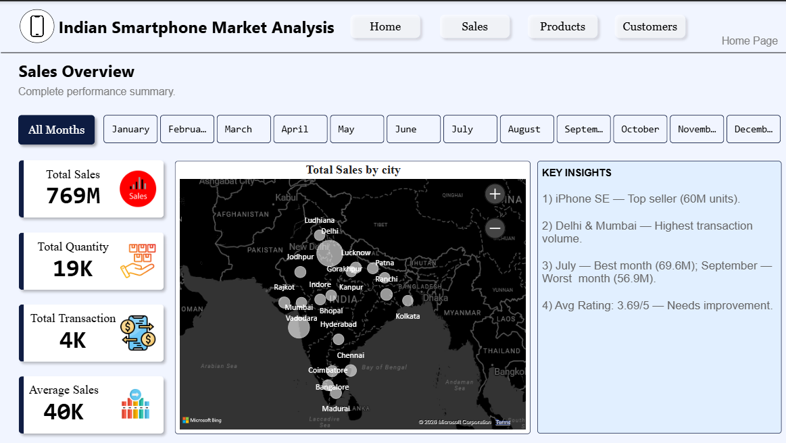
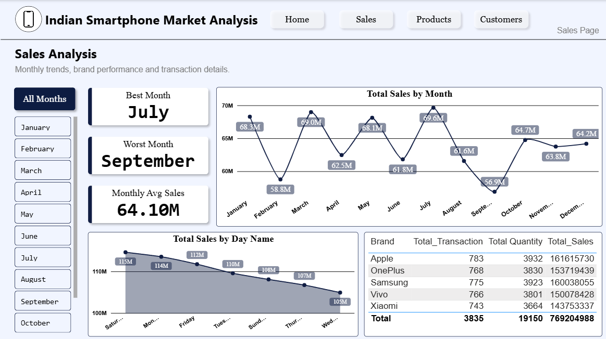
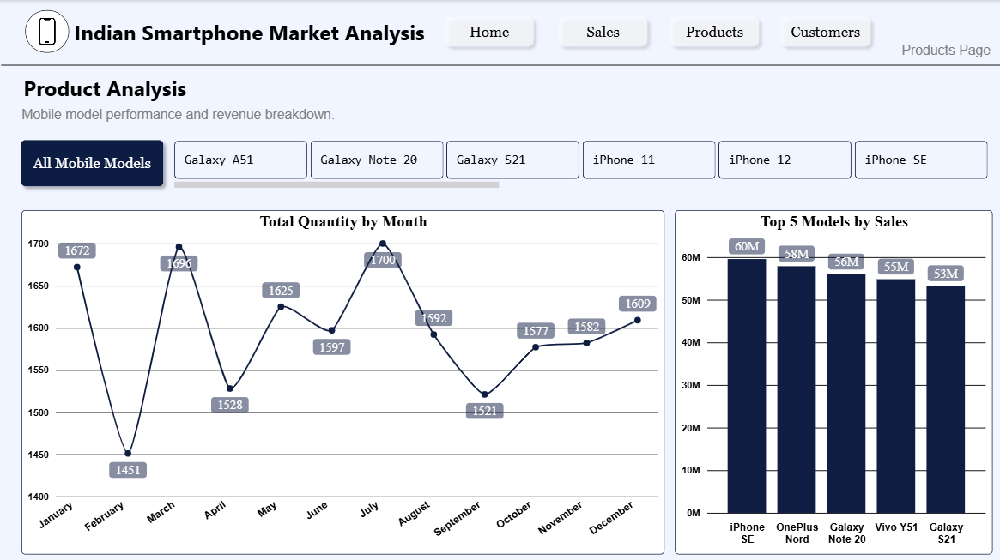
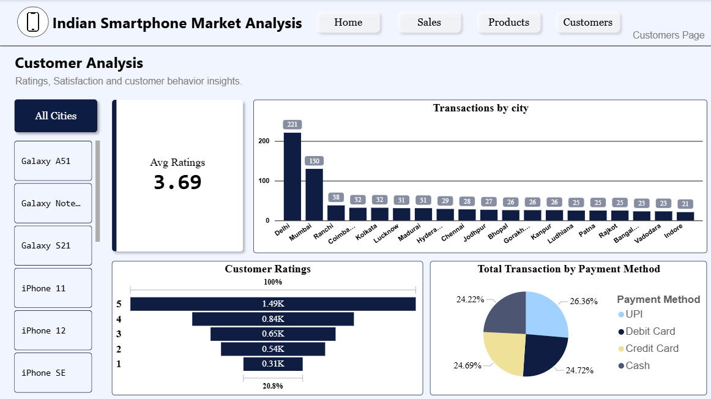

# 📱 Indian Smartphone Market Analysis Dashboard

An interactive Power BI dashboard analyzing smartphone sales, product performance, and customer behavior across major Indian cities.

## 🎯 Project Overview

This dashboard provides a complete sales analysis covering:
- Overall sales performance and trends
- Brand & model-wise product analysis
- Customer ratings, satisfaction, and payment preferences
- City-wise transaction and revenue distribution

## 🔑 Key Insights

- **iPhone SE** is the top-selling model with 60M units sold
- **Delhi & Mumbai** recorded the highest transaction volumes
- **July** was the best-performing month (69.6M sales), while **September** was the lowest (56.9M)
- Average customer rating stands at **3.69/5**, indicating room for improvement

## 📊 Dashboard Pages

### 1. Home / Sales Overview
Complete performance summary with KPIs, geographic sales distribution, and key insights.

### 2. Sales Analysis
Monthly sales trends, brand performance, and transaction details.

### 3. Product Analysis
Mobile model performance, quantity trends, and top-selling products.

### 4. Customer Analysis
Customer ratings, satisfaction levels, and payment method distribution.

## 🛠️ Tools Used

- **Power BI Desktop** — Data visualization & dashboard design
- **DAX** — Custom measures and calculations

## 📂 Files

- `Indian-Smartphone-Market-Analysis-Dashboard.pbix` — Power BI project file
- Screenshots of all 4 dashboard pages

## 📌 About

This project was built as a hands-on practice in data analysis and dashboard storytelling, focusing on translating raw sales data into actionable business insights.

---

⭐ Feel free to explore the `.pbix` file in Power BI Desktop for interactive analysis!
